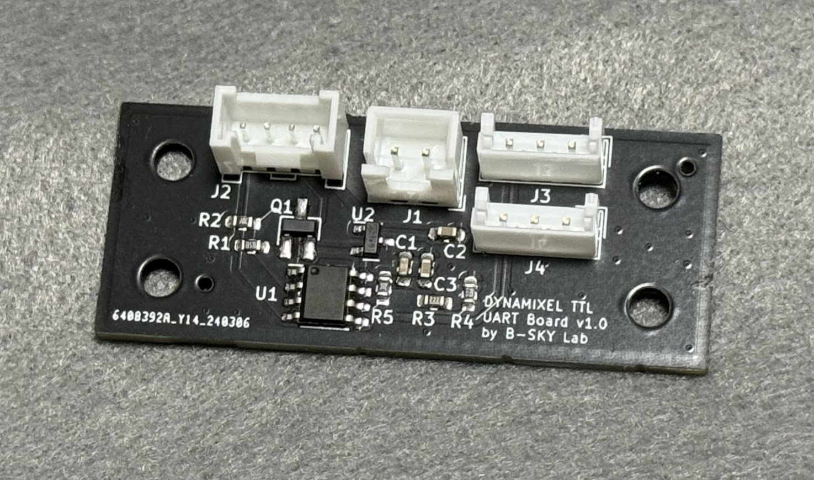
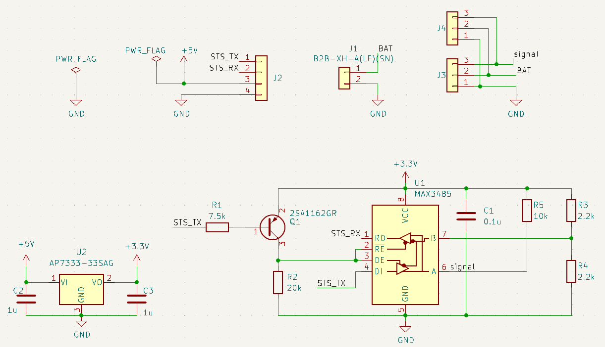

# DYNAMIXEL TTL interface board for M5Stack

## About
M5StackからDYNAMIXEL TTL対応のシリアルサーボを操作するためのオリジナル基板です．KiCAD 7で設計しました．

## Appearance

## Usage

配線と動作の様子はこちら．

https://www.youtube.com/watch?v=RdcbOagrEI8

## Schematics

## BOM
| Symbol | Model Number |URL, Values|
| --- | --- | --- |
| Q1  | 2SA1162GR  | [https://akizukidenshi.com/catalog/g/gI-02702/](https://akizukidenshi.com/catalog/g/gI-02702/)  |
| U1  | MAX3485ED  | [https://akizukidenshi.com/catalog/g/gI-16211/](https://akizukidenshi.com/catalog/g/gI-16211/)  |
| U2  | AP7333  | [https://akizukidenshi.com/catalog/g/gI-11360/](https://akizukidenshi.com/catalog/g/gI-11360/)  |
| J1  | JST B4B-PH-K-S(LF)(SN) | [https://www.sengoku.co.jp/mod/sgk\_cart/detail.php?code=4DK2-SDDB](https://www.sengoku.co.jp/mod/sgk_cart/detail.php?code=4DK2-SDDB)  |
| J2  | HY2.0-4PZZ | [https://ssci.to/1122](https://ssci.to/1122)  |
| J3  | B3B-EH(LF)(SN) | [https://www.sengoku.co.jp/mod/sgk_cart/detail.php?code=EEHD-4KBP](https://www.sengoku.co.jp/mod/sgk_cart/detail.php?code=EEHD-4KBP)  |
| R   | 0608 inch / 1608 jis metric | R1=7.5k, R2=20k, R3=R4=2.2k |
| C   | 0608 inch / 1608 jis metric | C1=0.1 u, C2=C3=1u |

## Exammple code

### Arduino IDE

1. Dynamixel2Arduinoライブラリをインストールします．ROBOTIS e-manualを参照してください．
    Install Dynamixel2Arduino library from ROBOTIS e-manual.
   
    ROBOTIS e-manual : [日本語](https://emanual.robotis.com/docs/en/software/arduino_ide_jp/), [English](https://emanual.robotis.com/docs/en/software/arduino_ide/)

3. Arduino IDEで[同封のサンプルコード](example_m5core2_dynamixel_arduino_ide/example_m5core2_dynamixel_arduino_ide.ino)を開いて，M5Stack Core2へ書き込みます．
    Open the enclosed [example code](example_m5core2_dynamixel_arduino_ide/example_m5core2_dynamixel_arduino_ide.ino) with Arduino IDE and write it to M5Stack Core2.

4. [Usage](#usage) の動画を参考に配線して電源を投入してください．
    Please refer to the Usage video to wire and turn on the power.

### PlatformIO

comming soon :)

## NOTE
ご自身の環境で本リポジトリを利用する際は，`HY2.0-4P.kicad_mod` を適切なライブラリへインポートしてお使いください．
作者はグローバルライブラリへインポートして複数プロジェクトから利用できるようにしています．

When using this repository in your own environment, please import HY2.0-4P.kicad_mod into the appropriate library. 
I import it into the global library so that it can be used from other projects as well.

## Distribution
本基板（完成品）はboothで頒布中です．よろしければご利用ください．

[https://b-sky-lab.booth.pm/items/5576375](https://b-sky-lab.booth.pm/items/5576375)

## Disclaimer
MITライセンスでの公開です．本設計および頒布した基板において生じた一切の損害等について作者は責任を負いません．予めご了承ください．

This is released under the MIT license. The author is not responsible for any damage caused to this design or the distributed board. Please note.
